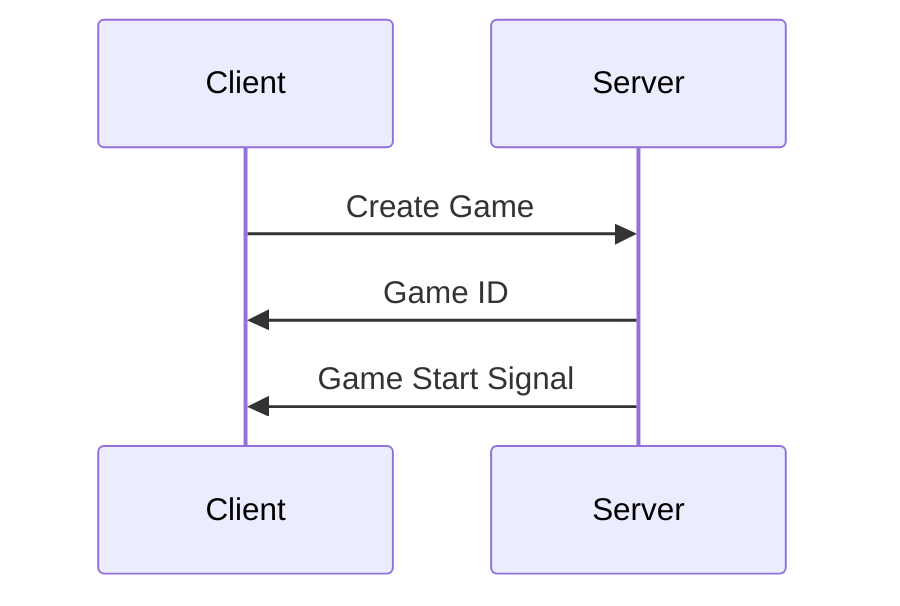
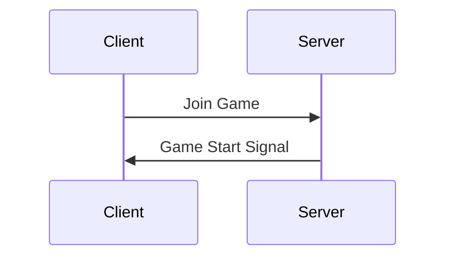
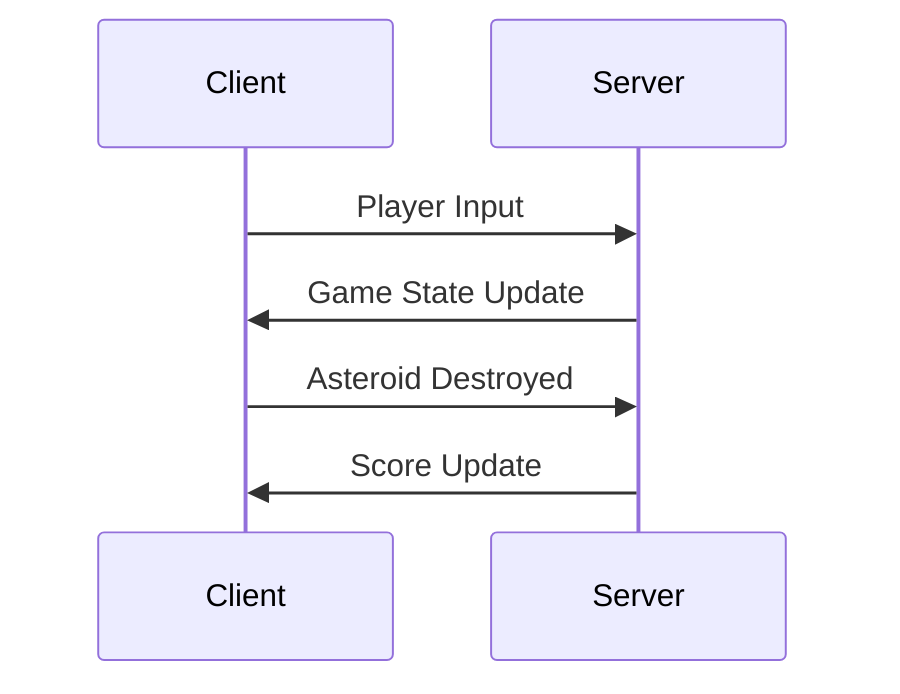

# Networking Documentation for 2D Space Arcade Game

## Table of Contents
1. [Client-Server Communication Overview](#client-server-communication-overview)
2. [WebSocket and Socket.IO](#websocket-and-socketio)
3. [Game States](#game-states)
4. [Information Flow Diagrams](#information-flow-diagrams)
5. [Data Structures](#data-structures)
6. [Network Message Types](#network-message-types)

## Client-Server Communication Overview
### Overview
Our game uses a client-server architecture with real-time communication via WebSocket, implemented through Socket.IO. The server is built with Flask and Flask-SocketIO, while the client uses Phaser for game rendering and the Socket.IO client library for network communication.

### Key Components:

* Server: Flask with Flask-SocketIO
* Client: Phaser game engine with Socket.IO client
* Protocol: WebSocket (with Socket.IO fallbacks)

## WebSocket and Socket.IO

WebSocket is the primary protocol used for real-time, full-duplex communication between the client and server. Socket.IO is built on top of WebSocket and provides additional features:

* Fallback to other methods if WebSocket is unavailable
* Automatic reconnection
* Packet buffering
* Room-based broadcasting

## Game States

1. Lobby/Waiting Room
    * Player 1 creates a game and receives a game ID 
    * Player 2 joins a game using a game ID
2. Game Start
    * Server initializes game state
    * Clients load necessary assets
3. In-Game
    * Active gameplay
    * Continuous updates between client and server
4. Game Over
    * Final game state sent to clients

## Information Flow Diagrams

### Lobby Flow - First Player to Join


### Lobby Flow - Second Player to Join


### In-Game Flow


## Data Structures

### Player Data
```javascript
{
  id: string,
  position: {x: number, y: number},
  score: number
}
```

### Asteroid Data
```javascript
{
  id: string,
  position: {x: number, y: number},
  velocity: {x: number, y: number},
  size: number
}
```

### Game State
```javascript
{
  players: [PlayerData],
  asteroids: [AsteroidData],
  gameTime: number
}
```

## Network Message Types

### Client to Server

* playerMove: {playerId: string, position: {x: number, y: number}}
* playerShoot: {playerId: string, bulletId: string, position: {x: number, y: number}, velocity: {x: number, y: number}}

### Server to Client

* gameStateUpdate: {state: GameState}
* playerJoined: {playerId: string}
* playerLeft: {playerId: string}
* gameOver: {winnerId: string, scores: {playerId: string, score: number}[]}